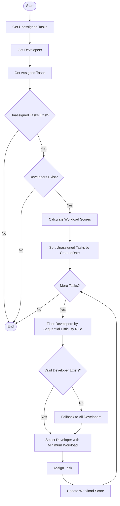

# TaskFlow

TaskFlow, görevlerin geliştiricilere **akıllı ve dengeli bir şekilde dağıtılmasını** sağlayan bir görev yönetim sistemidir.  
Sistem, mevcut iş yükü ve görev zorluk seviyelerini dikkate alarak otomatik atama yapar.

##  Öne Çıkan Özellikler

- Dinamik iş yükü bazlı görev dağıtımı
- Zorluk katsayısı destekli skor hesaplama
- Strategy Pattern ile genişletilebilir atama algoritması
- In-Memory veritabanı ile sıfır konfigürasyon

##  Mimari ve Teknik Altyapı

###  Proje Yapısı
- ASP.NET Core MVC (.NET 8)
- Katmanlı Mimari (Presentation, Business, Data, Models)
- Dependency Injection

###  Veri Katmanı
- Entity Framework Core
- EF Core In-Memory Provider
- Code First yaklaşımı
- Seed Data ile otomatik veri üretimi

###  İş Mantığı
- SOLID prensiplerine uygun servis tasarımı
- Strategy Pattern (Görev atama algoritması için)
- Dinamik iş yükü hesaplama mekanizması

## Akıllı Atama Algoritması

Sistem, görevleri geliştiricilerin mevcut iş yüküne göre dağıtır.




##  Ekranlar

### Ana Sayfa / Task Listesi
Tüm görevlerin listelendiği, filtrelenebildiği ve detaylarının görüntülenebildiği sayfa.

### Task Tanımlama
Yeni görev oluşturma, zorluk seviyesi belirleme ve önceliklendirme ekranı.

### Task Atama
Sistemin otomatik olarak görevleri en uygun geliştiricilere atadığı ve sonuçların görüntülendiği sayfa.

## Kurulum ve Çalıştırma

Projeyi klonladıktan sonra aşağıdaki komut ile çalıştırmanız yeterlidir:

```bash
git clone https://github.com/berkayozturkk/TaskFlow.git
cd TaskFlow/TaskFlow
dotnet run
```
Uygulama çalıştırıldığında konsolda belirtilen localhost adresinden erişilebilir veya Visual Studio üzerinden Solution dosyasını açıp F5 ile başlatabilirsiniz.

## Veritabanı

Proje **Entity Framework Core In-Memory Provider** kullanmaktadır.

- Ek bir veritabanı kurulumu gerekmez.
- Migration işlemi gerekmez.
- Connection string yapılandırması gerekmez.
- Uygulama her çalıştırıldığında veritabanı otomatik olarak oluşturulur.
- Seed data ile örnek geliştirici ve görev kayıtları başlangıçta yüklenir.
- Uygulama yeniden başlatıldığında tüm veriler sıfırlanır.
